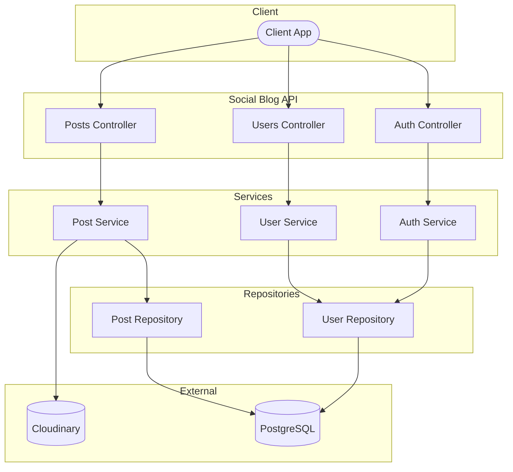
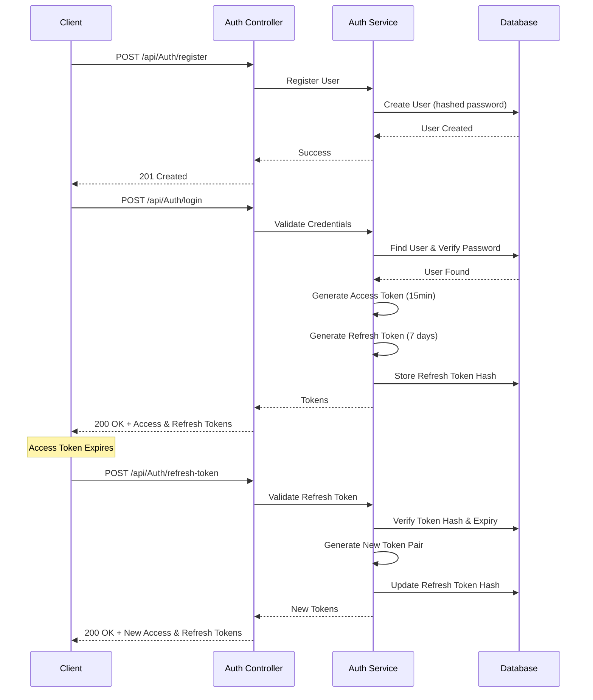

# Social Blog API


A modern RESTful API for a social blogging platform built with ASP.NET Core. Features secure JWT authentication with refresh tokens, role-based authorization, image uploads via Cloudinary, and full CRUD operations for posts and user management.

## Architecture



## Authentication Flow



## Features

- **Dual-Token Authentication** - Short-lived access tokens (15min) + long-lived refresh tokens (7 days)
- **Role-Based Authorization** - Admin and User roles with protected endpoints
- **Image Uploads** - Cloudinary integration for post images
- **Soft Delete** - Posts are marked as deleted, not permanently removed
- **Pagination** - Efficient data retrieval with page/pageSize parameters
- **Input Validation** - Comprehensive request validation with custom attributes
- **API Documentation** - Interactive Swagger UI with JWT support
- **Docker Ready** - Containerized deployment with docker-compose

## Tech Stack

| Technology            | Purpose               |
| --------------------- | --------------------- |
| .NET 10.0             | Runtime & Framework   |
| ASP.NET Core          | Web API Framework     |
| Entity Framework Core | ORM & Database Access |
| PostgreSQL 16         | Database              |
| BCrypt.Net            | Password Hashing      |
| Cloudinary            | Image Storage         |
| Swashbuckle           | Swagger/OpenAPI Docs  |
| Docker                | Containerization      |

## Prerequisites

- [.NET 10 SDK](https://dotnet.microsoft.com/download)
- [PostgreSQL 16](https://www.postgresql.org/download/) (local) **OR** [Docker Desktop](https://www.docker.com/products/docker-desktop)
- [Cloudinary Account](https://cloudinary.com/) (free tier available)

## Getting Started

### Option 1: Docker (Recommended)

```bash
# Clone the repository
git clone https://github.com/kehinde-durodola/social-blog-api.git
cd social-blog-api

# Start API and PostgreSQL containers
docker-compose up --build

# API available at http://localhost:5228
# Swagger UI at http://localhost:5228/swagger
```

### Option 2: Local Development

1. **Clone and navigate**

   ```bash
   git clone https://github.com/kehinde-durodola/social-blog-api.git
   cd social-blog-api
   ```

2. **Configure environment**

   Update `appsettings.Development.json`:

   ```json
   {
     "ConnectionStrings": {
       "DefaultConnection": "Host=localhost;Port=5432;Database=socialblog;Username=postgres;Password=your_password"
     },
     "Jwt": {
       "SecretKey": "your-secret-key-at-least-32-characters",
       "Issuer": "SocialBlogApi",
       "Audience": "SocialBlogApi",
       "AccessTokenExpirationMinutes": 15,
       "RefreshTokenExpirationDays": 7
     },
     "Cloudinary": {
       "CloudName": "your-cloud-name",
       "ApiKey": "your-api-key",
       "ApiSecret": "your-api-secret"
     }
   }
   ```

3. **Apply database migrations**

   ```bash
   dotnet ef database update
   ```

4. **Run the application**
   ```bash
   dotnet run
   ```

## API Endpoints

### Authentication

| Method | Endpoint                  | Description          | Auth |
| ------ | ------------------------- | -------------------- | ---- |
| POST   | `/api/Auth/register`      | Register new user    | ❌   |
| POST   | `/api/Auth/login`         | Login and get tokens | ❌   |
| POST   | `/api/Auth/refresh-token` | Refresh access token | ❌   |

### Posts

| Method | Endpoint          | Description               | Auth           |
| ------ | ----------------- | ------------------------- | -------------- |
| GET    | `/api/Posts`      | Get all posts (paginated) | ❌             |
| GET    | `/api/Posts/{id}` | Get post by ID            | ❌             |
| POST   | `/api/Posts`      | Create new post           | ✅ User        |
| PUT    | `/api/Posts/{id}` | Update post               | ✅ Owner       |
| DELETE | `/api/Posts/{id}` | Delete post (soft)        | ✅ Owner/Admin |

### Users

| Method | Endpoint              | Description               | Auth     |
| ------ | --------------------- | ------------------------- | -------- |
| GET    | `/api/Users`          | Get all users (paginated) | ✅ Admin |
| GET    | `/api/Users/{id}`     | Get user profile          | ✅ User  |
| PUT    | `/api/Users/{id}`     | Update profile            | ✅ Owner |
| PUT    | `/api/Users/{id}/ban` | Ban user                  | ✅ Admin |
| DELETE | `/api/Users/{id}`     | Delete user               | ✅ Admin |

## Project Structure

```
social-blog-api/
├── Controllers/          # API endpoints
│   ├── AuthController.cs
│   ├── PostsController.cs
│   └── UsersController.cs
├── Services/             # Business logic
│   ├── Interfaces/
│   ├── AuthService.cs
│   ├── PostService.cs
│   └── UserService.cs
├── Repositories/         # Data access layer
│   ├── Interfaces/
│   ├── UserRepository.cs
│   └── PostRepository.cs
├── Models/               # Entity models
│   ├── User.cs
│   └── Post.cs
├── DTOs/                 # Data transfer objects
│   ├── Auth/
│   ├── Posts/
│   └── Users/
├── Data/                 # Database context
│   └── AppDbContext.cs
├── Core/                 # Shared utilities
│   └── Validation/
├── Migrations/           # EF Core migrations
├── Properties/
├── Program.cs            # Application entry point
├── Dockerfile
├── docker-compose.yml
└── appsettings.json
```

## Environment Variables

For production deployment, configure these environment variables:

| Variable                               | Description                    |
| -------------------------------------- | ------------------------------ |
| `ConnectionStrings__DefaultConnection` | PostgreSQL connection string   |
| `Jwt__SecretKey`                       | JWT signing key (min 32 chars) |
| `Jwt__Issuer`                          | Token issuer                   |
| `Jwt__Audience`                        | Token audience                 |
| `Jwt__AccessTokenExpirationMinutes`    | Access token lifetime          |
| `Jwt__RefreshTokenExpirationDays`      | Refresh token lifetime         |
| `Cloudinary__CloudName`                | Cloudinary cloud name          |
| `Cloudinary__ApiKey`                   | Cloudinary API key             |
| `Cloudinary__ApiSecret`                | Cloudinary API secret          |

## Docker Commands

```bash
# Build and start containers
docker-compose up --build

# Start in background
docker-compose up -d

# View logs
docker-compose logs -f api

# Stop containers (keep data)
docker-compose down

# Stop and remove data
docker-compose down -v
```

## License

This project is licensed under the MIT License - see the [LICENSE](LICENSE) file for details.

## Author

**Kehinde Durodola**

[](https://github.com/kehinde-durodola)
[](https://www.linkedin.com/in/kehinde-durodola/)
